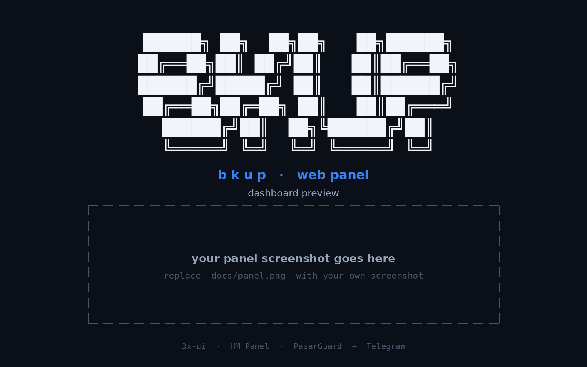

<div dir="rtl" align="center">

# bkup

**بکاپ‌گیری خودکار از 3x-ui، HM Panel و PasarGuard — ارسال مستقیم به تلگرام شما.**

یک سرویس کامل با **پنل وب** و **منوی ترمینال**: به همه پنل‌هایی که تنظیم می‌کنید
وصل می‌شود، طبق زمان‌بندی شما **بکاپ کامل** می‌گیرد و آن را به‌صورت فایل به چت یا
کانال **تلگرام** شما ارسال می‌کند.

[](https://github.com/AliRezaC-xrol/bkup/releases/latest)
[](https://github.com/AliRezaC-xrol/bkup/stargazers)
[](https://github.com/AliRezaC-xrol/bkup/releases)

[نصب](#نصب) · [شروع سریع](#شروع-سریع) · [امکانات](#امکانات) · [آپدیت](#آپدیت) · [منوی ترمینال](#منوی-ترمینال) · [English Docs](README.md)

</div>

---

## نحوه کار

```
  3x-ui ────────┐
  HM Panel ─────┤   bkup از هر پنل فعال، طبق زمان‌بندی شما بکاپ کامل می‌گیرد
  PasarGuard ───┘
                                │
                                ▼
                      چت تلگرام شما  ← هر بکاپ به‌صورت فایل می‌رسد
```

`bkup` به‌صورت یک سرویس systemd امن اجرا می‌شود — با سقف CPU/RAM، ری‌استارت خودکار
و اجرای خودکار بعد از ری‌بوت. هر پنل مستقل است: هر کدام را که بخواهید فعال کنید و
هر کدام دکمه تست اتصال خودش را دارد. فاصله زمانی بکاپ بر حسب **ثانیه** است.

## نصب

یک دستور با دسترسی root روی سرور. اگر Node.js 20 نبود نصب می‌کند، **آخرین نسخه**
را از گیت‌هاب دانلود و کد را با آن تطبیق می‌دهد، بیلد و سرویس را اجرا می‌کند و در
پایان آدرس پنل و رمز آن را نمایش می‌دهد:

```bash
sudo bash <(curl -fsSL https://raw.githubusercontent.com/AliRezaC-xrol/bkup/main/install.sh)
```

اجرای مجدد همین دستور روی سرورِ نصب‌شده یعنی **آپدیت درجا** — دیتابیس، تنظیمات و
بکاپ‌ها حفظ می‌شوند.

## شروع سریع

| مرحله | کجا | چه کاری |
|---|---|---|
| **۱** | نصب‌کننده | انتخاب پورت (یا پورت تصادفی) و رمز پنل |
| **۲** | مرورگر | باز کردن `http://<server-ip>:<port>` و ورود با رمز |
| **۳** | **Settings** | اتصال 3x-ui / HM Panel / PasarGuard — زدن دکمه تست |
| **۴** | **Settings** | افزودن توکن بات تلگرام + آیدی چت — زدن دکمه تست |
| **۵** | **Settings** | تنظیم فاصله بکاپ و روشن کردن **Auto backup** |

بکاپ‌ها بلافاصله به تلگرام ارسال می‌شوند.

## امکانات

- **هر سه پنل همزمان** — 3x-ui، HM Panel و PasarGuard، هر کدام مستقل با دکمه تست خودش
- **ارسال به تلگرام** — هر بکاپ به‌صورت فایل به چت یا کانال شما می‌رود
- **زمان‌بندی آزاد** — فاصله بر حسب ثانیه، پایدار بعد از ری‌بوت با systemd
- **پنل وب** — داشبورد، لاگ زنده، تاریخچه بکاپ، دانلود یا حذف هر بکاپ
- **منوی ترمینال (`bkup`)** — وضعیت، آدرس پنل، رمز، پورت، لاگ، آپدیت، حذف
- **آپدیت امن** — نصب‌کننده و آپدیت‌کننده همیشه آخرین ریلیز گیت‌هاب را می‌گیرند، کد را با تگ تطبیق می‌دهند و هر چیز دیگری را رد می‌کنند؛ دیتای شما دست‌نخورده می‌ماند
- **مصرف کم** — سقف CPU/RAM روی سرویس، بکاپ‌ها مستقیم به تلگرام ارسال می‌شوند

## آپدیت

| از کجا | چطور |
|---|---|
| پنل وب | **System → Check for updates → Update** |
| ترمینال | `bkup` → **Update** |
| هر جا | اجرای مجدد دستور نصب بالا |

نسخه‌ای که در پنل نمایش داده می‌شود در زمان بیلد از خود ریلیز تزریق می‌شود — بعد
از آپدیت همیشه نسخه‌ای را نشان می‌دهد که واقعاً در حال اجراست.

## منوی ترمینال

روی سرور `bkup` را اجرا کنید:

| گزینه | کاربرد |
|---|---|
| **Status** | وضعیت سرویس، نسخه نصب‌شده، وجود آپدیت |
| **Web panel URL** | نمایش آدرس و پورت پنل |
| **Password** | تغییر رمز پنل وب |
| **Port** | تغییر پورت پنل وب |
| **Logs** | مشاهده زنده لاگ سرویس |
| **Update** | دانلود و نصب آخرین نسخه درجا، با حفظ دیتا |
| **Uninstall** | حذف سرویس و برنامه |

## حذف

اجرای `bkup` → **Uninstall**.

## پیش‌نمایش پنل

<div align="center">

</div>

## مسیرهای سرور

| مسیر / دستور | کاربرد |
|---|---|
| `/opt/bkup` | پوشه برنامه |
| `/opt/bkup/.env` | پورت و مسیرها |
| `/opt/bkup/db/custom.db` | دیتابیس تنظیمات |
| `/opt/bkup/backups` | نسخه محلی بکاپ‌ها |
| `bkup` | دستور منوی ترمینال |
| `bkup.service` | سرویس systemd |

---

[English Documentation](README.md)
