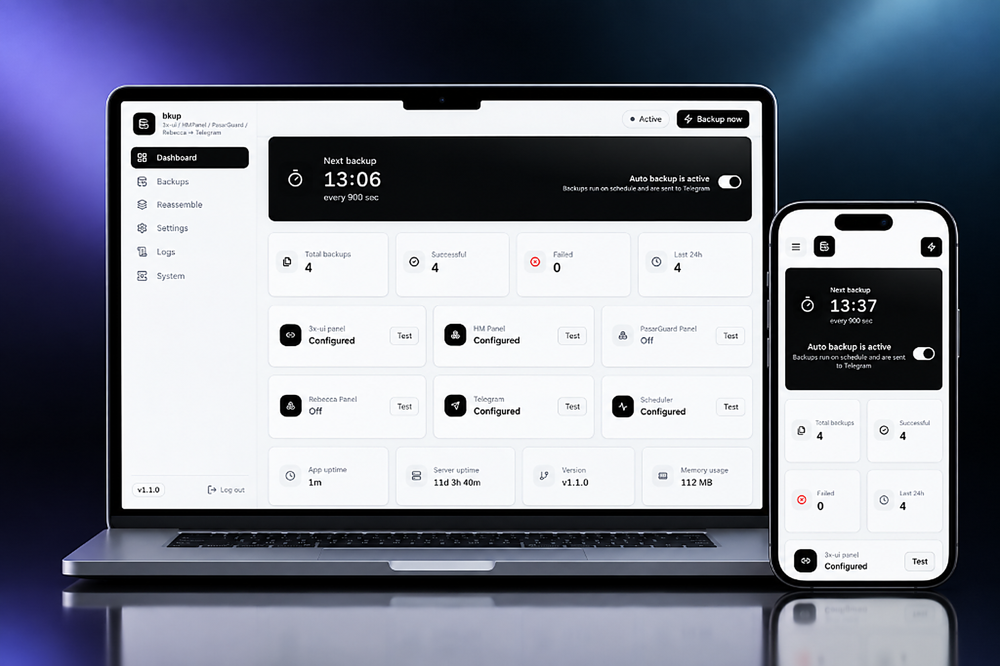
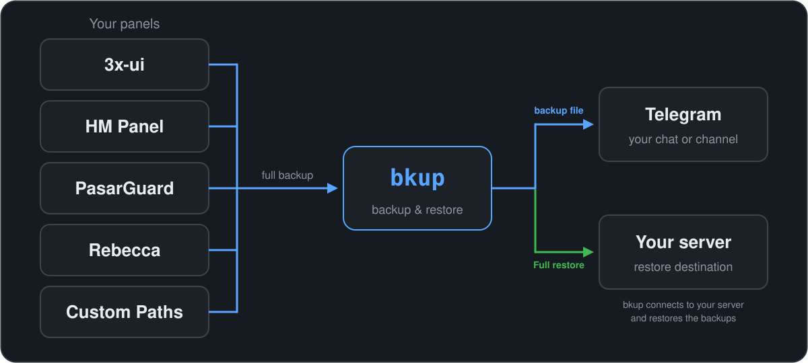

<div dir="rtl" align="center">


**بکاپ خودکار از پنل‌های 3x-ui ، HM Panel ، PasarGuard , Rebecca — تحویل مستقیم در تلگرام**

[](https://github.com/AliRezaC-xrol/bkup/releases/latest)
[](https://github.com/AliRezaC-xrol/bkup/releases)
[](https://github.com/AliRezaC-xrol/bkup/stargazers)



[معرفی](#معرفی) · [امکانات](#امکانات) · [چسباندن پارت‌ها](#چسباندن-پارت‌های-بکاپ) · [نصب](#نصب) · [شروع سریع](#شروع-سریع) · [آپدیت](#آپدیت) · [منوی ترمینال](#منوی-ترمینال) · [English](README.md)

</div>

<div dir="rtl" align="right">

## معرفی

`bkup` به همهٔ پنل‌هایی که به آن معرفی می‌کنید وصل می‌شود، در بازهٔ زمانی که
تعیین می‌کنید از هرکدام بکاپ کامل می‌گیرد و خروجی را به‌صورت فایل به چت یا
کانال تلگرام می‌فرستد. سرویس روی سرور خودتان اجرا می‌شود؛ مصرفش سقف دارد،
اگر متوقف شود خودش بالا می‌آید و بعد از ری‌بوت هم از دست نمی‌رود.

هر پنل جدا تنظیم می‌شود: هر کدام را استفاده می‌کنید فعال کنید و اتصالش را با
یک کلیک تست کنید. فاصلهٔ بکاپ بر حسب ثانیه تعیین می‌شود؛ از چند بکاپ در روز
تا یکی در هر چند دقیقه، همین یک نصب کافی است.

</div>

<div align="center">



</div>

<div dir="rtl" align="right">

## امکانات

- **هر چهار پنل، یک‌جا** — 3x-ui، HM Panel، PasarGuard و Rebecca؛ هر پنل مستقل فعال می‌شود و دکمهٔ تست اتصال خودش را دارد
- **تحویل در تلگرام** — هر بکاپ به‌صورت فایل به چت یا کانال شما می‌رسد؛ چیزی برای دانلود دستی باقی نمی‌ماند
- **زمان‌بندی به سلیقهٔ شما** — فاصلهٔ بکاپ بر حسب ثانیه؛ سرویس systemd آن را بعد از ری‌بوت هم ادامه می‌دهد
- **پنل وب** — داشبورد، لاگ زنده و تاریخچهٔ بکاپ، با دانلود یا حذف هر نسخه
- **چسباندن پارت‌ها در پنل وب** — پارت‌هایی که تلگرام می‌فرستد را در تب Reassemble آپلود می‌کنید و همان‌جا به بکاپ کامل برمی‌گردند؛ با تاریخچه و دانلود
- **منوی ترمینال** — `bkup` وضعیت، آدرس پنل، رمز، پورت، لاگ، آپدیت و حذف را بدون باز کردن مرورگر انجام می‌دهد

## نصب

اگر Node.js 20 روی سرور نباشد نصب می‌شود، **آخرین نسخهٔ** منتشرشده دانلود و
صحتش تأیید می‌شود، برنامه بیلد و سرویس ثبت می‌شود و در پایان آدرس پنل و رمز
آن نمایش داده می‌شود:

</div>

```bash
bash <(curl -fsSL https://raw.githubusercontent.com/AliRezaC-xrol/bkup/main/install.sh)
```

<div dir="rtl" align="right">


## شروع سریع

| مرحله | کجا | چه کار |
|---|---|---|
| **۱** | نصب‌کننده | انتخاب پورت (یا پورت تصادفی) و رمز پنل |
| **۲** | مرورگر | باز کردن `http://<server-ip>:<port>` و ورود با رمز |
| **۳** | **Settings** | وصل کردن 3x-ui / HM Panel / PasarGuard / Rebecca و زدن دکمهٔ تست |
| **۴** | **Settings** | وارد کردن توکن بات تلگرام و آیدی چت و زدن دکمهٔ تست |
| **۵** | **Settings** | تعیین فاصلهٔ بکاپ و روشن کردن **Auto backup** |

## آپدیت

| از کجا | چطور |
|---|---|
| پنل وب | **System → Check for updates → Update** |
| ترمینال | `bkup` → **Update** |
| هر جا | اجرای مجدد دستور نصب |

شمارهٔ نسخه‌ای که در پنل دیده می‌شود در زمان بیلد از خود کد تزریق می‌شود؛ پس
از آپدیت همیشه با چیزی که واقعاً روی سرور اجراست یکی است.

## چسباندن پارت‌های بکاپ

بکاپ‌های بزرگ‌تر از ۵۰ مگابایت به‌صورت پارت‌های شماره‌دار به تلگرام می‌رسند.
در تب **Reassemble** پنل وب پارت‌ها را آپلود کنید و **Reassemble and store**
را بزنید؛ پارت‌ها به‌طور خودکار بر اساس شمارهٔ خودشان مرتب و بایت‌به‌بایت به
فایل اصلی بکاپ تبدیل می‌شوند. تاریخچهٔ هر تبدیل نگه داشته می‌شود و هر رکورد
دکمهٔ دانلود و حذف دارد.

برای هر چهار پنل کار می‌کند — 3x-ui، HM Panel، PasarGuard و Rebecca — چون
پارت‌ها تکه‌های دقیق همان فایل بکاپ خود پنل‌اند.

## منوی ترمینال

روی سرور `bkup` را اجرا کنید:

| گزینه | کاربرد |
|---|---|
| **Status** | وضعیت سرویس، نسخهٔ نصب‌شده، وجود آپدیت |
| **Web panel URL** | نمایش آدرس و پورت پنل |
| **Password** | تغییر رمز پنل وب |
| **Port** | تغییر پورت پنل وب |
| **Logs** | دنبال‌کردن زندهٔ لاگ سرویس |
| **Start panel** | روشن‌کردن سرویس وب‌پنل |
| **Stop panel** | خاموش‌کردن سرویس وب‌پنل |
| **Restart panel** | ری‌استارت سرویس وب‌پنل |
| **Update** | نصب آخرین نسخه درجا، با حفظ دیتا |
| **Uninstall** | حذف سرویس و برنامه |

## مسیرهای سرور

| مسیر / دستور | کاربرد |
|---|---|
| `/opt/bkup` | پوشهٔ برنامه |
| `/opt/bkup/.env` | پورت و مسیرها |
| `/opt/bkup/db/custom.db` | دیتابیس تنظیمات |
| `/opt/bkup/backups` | نسخهٔ محلی بکاپ‌ها |
| `bkup` | دستور منوی ترمینال |
| `bkup.service` | سرویس systemd |

## لایسنس

این پروژه تحت لایسنس انحصاری منتشر می‌شود؛ شرح کامل شرایط در فایل
[LICENSE](LICENSE) آمده است.

</div>
