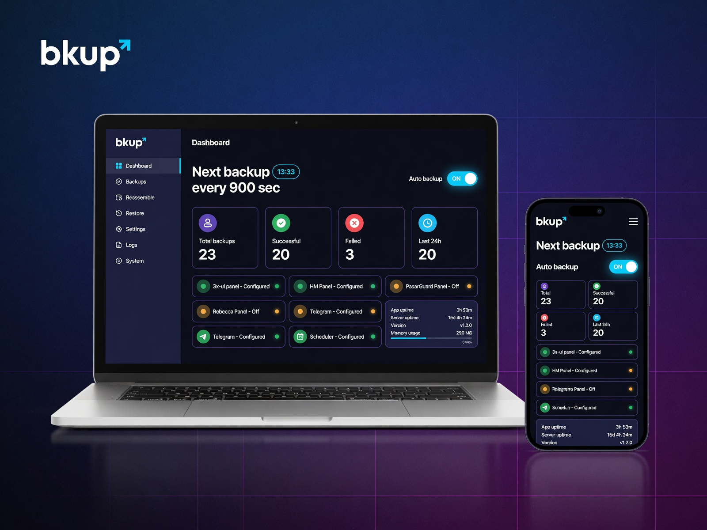

<div align="center">


**Auto backup & restore 3x-ui, HM Panel, PasarGuard, Rebecca.**

[](https://github.com/AliRezaC-xrol/bkup/releases/latest)
[](https://github.com/AliRezaC-xrol/bkup/releases)
[](https://github.com/AliRezaC-xrol/bkup/stargazers)



[Install](#install) · [First run](#first-run) · [Features](#features) · [Reassemble](#reassemble-backup-parts) · [Restore](#restore-to-a-remote-server) · [Update](#update) · [Terminal menu](#terminal-menu) · [Donate](#donate) · [مستندات فارسی](README.fa.md)

</div>

## What it does

`bkup` connects to every panel you configure, takes a **full backup** of each one
on the schedule you set, and sends it to your **Telegram** chat or channel as a
file. It runs as a systemd service on your own server — CPU and RAM capped,
restarted automatically if it stops, back on after a reboot.

<div align="center">


</div>

Each panel is configured separately: enable the ones you use and test every
connection with one click. The backup interval is set in **seconds**, so the
same install covers anything from a few backups a day to one every few minutes.

## Features

- **3x-ui, HM Panel, PasarGuard and Rebecca in one place** — each panel enabled independently, each with its own connection test
- **Telegram delivery** — every backup arrives as a file in your chat or channel; nothing to download by hand
- **Your schedule** — interval in seconds, kept across reboots by the systemd service
- **Web panel** — dashboard, live logs, backup history with per-backup download and delete
- **Reassemble split backups** — parts delivered to Telegram are merged back into the one complete file right in the web panel, with a downloadable history; you can also pick the parts straight from your stored backups instead of uploading them
- **Restore to any server** — push a backup (a normal run or a reassembled file) back onto a server over SSH; the panel is installed automatically if it is missing, every step streams live, and the run can be cancelled
- **Terminal menu** — `bkup` handles status, panel URL, password, port, logs, update and uninstall without opening the web panel

## Install

```bash
bash <(curl -fsSL https://raw.githubusercontent.com/AliRezaC-xrol/bkup/main/install.sh)
```

The command installs Node.js 20 if it is missing, downloads the **latest
release**, verifies it, builds the app and registers the service — then prints
the panel address and password. Run it again on the same server and it updates
in place, keeping every setting and backup.

## First run

| Step | Where | What to do |
|---|---|---|
| **1** | Installer | pick a port (or a random one) and a panel password |
| **2** | Browser | open `http://<server-ip>:<port>` and log in |
| **3** | **Settings** | connect 3x-ui, HM Panel, PasarGuard, Rebecca — press the test button |
| **4** | **Settings** | add your Telegram bot token and chat ID — press the test button |
| **5** | **Settings** | set the backup interval and turn **Auto backup** on |

## Update

| From | How |
|---|---|
| Web panel | **System → Check for updates → Update** |
| Terminal | `bkup` → **Update** |
| Anywhere | re-run the install command |

The version shown in the panel comes from the code at build time, so after an
update it always matches what is actually running.


## Reassemble Backup Parts

Backups larger than **50 MB** are split into multiple numbered parts before being sent to Telegram.

In the **Reassemble** section, you can upload these parts and convert them back into the original backup file. The parts are automatically sorted by their numbers and merged byte-by-byte, while the original files remain untouched.

You can also reassemble parts that are already stored in the **Backups** section. Simply select the parts you need; they are automatically arranged in the correct order, and duplicate part numbers are detected before the merge begins.

## Restore Backup to a Server

The **Restore** section lets you restore a backup directly to a server over **SSH**.

Select the target server, panel, optional **Cloudflare DNS** settings, and the backup you want to restore. Before starting, **bkup** displays a summary of the target server, selected backup, and panel.

During the restore, every step is displayed in real time. You can cancel the restore while it is running, and the result of every restore is recorded in **History**.

If the selected panel is not installed on the target server, **bkup** installs the panel first and then restores the selected backup.

## Donate

If **bkup** has been useful to you, even a single **STAR** on **GitHub** can be the greatest support for continuing the development of the project.

| Network | Address |
|---|---|
| **Tron (TRC20)** | `TQwEkXiBiFiQikD97iCk38eJJkQrirnwFS` |
| **TON (Toncoin)** | `UQDPCYKMhkA9hERfhLYNXIvl1dbV0ZKf4k7quu61iehEeMb1` |
| **Tether USD (TRC20)** | `TQwEkXiBiFiQikD97iCk38eJJkQrirnwFS` |

## Terminal menu

Run `bkup` on the server:

| Option | Purpose |
|---|---|
| **Status** | service state, installed version, update availability |
| **Web panel URL** | prints the address and port |
| **Password** | change the panel password |
| **Port** | change the panel port |
| **Logs** | follow the live service logs |
| **Start panel** | start the web panel service |
| **Stop panel** | stop the web panel service |
| **Restart panel** | restart the web panel service |
| **Update** | install the latest release in place, data preserved |
| **Uninstall** | remove the service and the application |

## Server paths

| Path / command | What it is |
|---|---|
| `/opt/bkup` | application directory |
| `/opt/bkup/.env` | port and paths |
| `/opt/bkup/db/custom.db` | settings database |
| `/opt/bkup/backups` | local copies of the backups |
| `bkup` | terminal menu command |
| `bkup.service` | systemd service |

## License

This project is distributed under a proprietary license — see
[LICENSE](LICENSE) for the terms.
